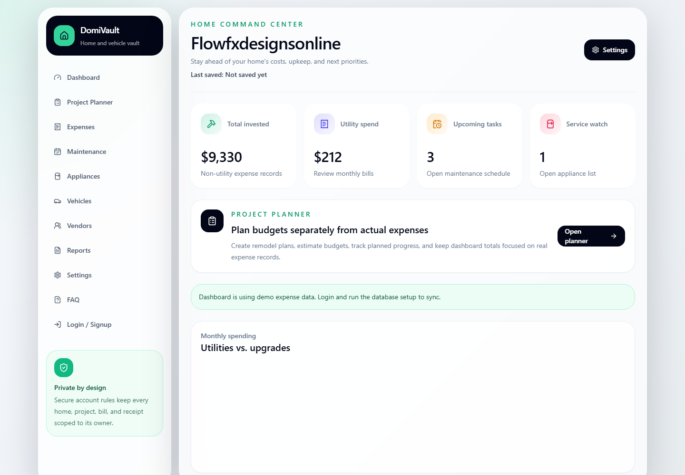
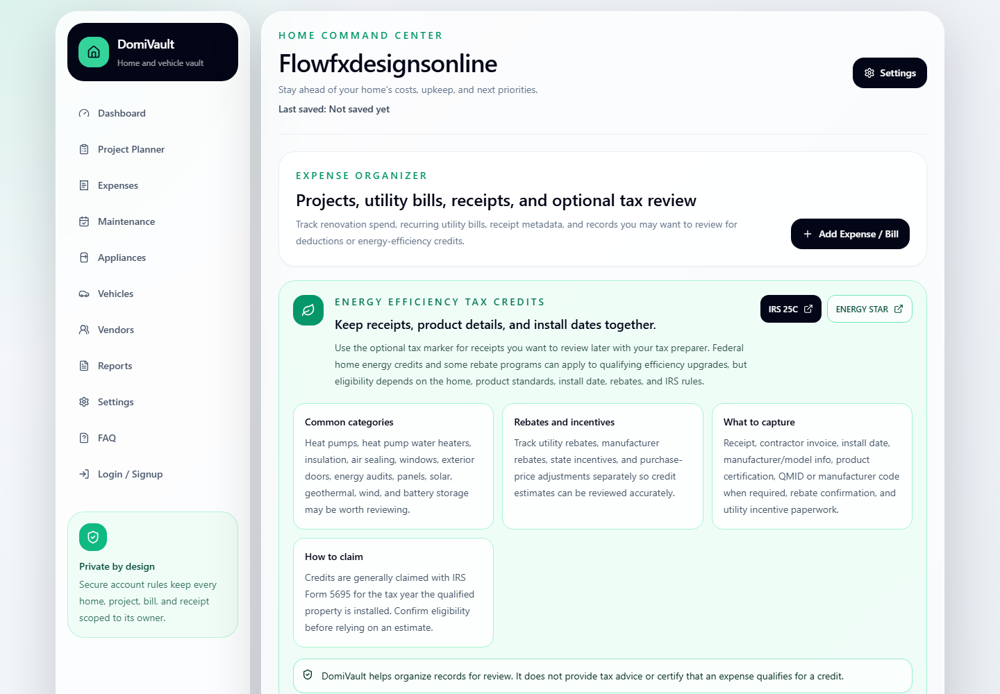
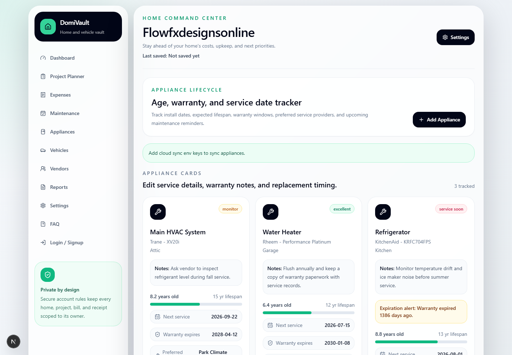
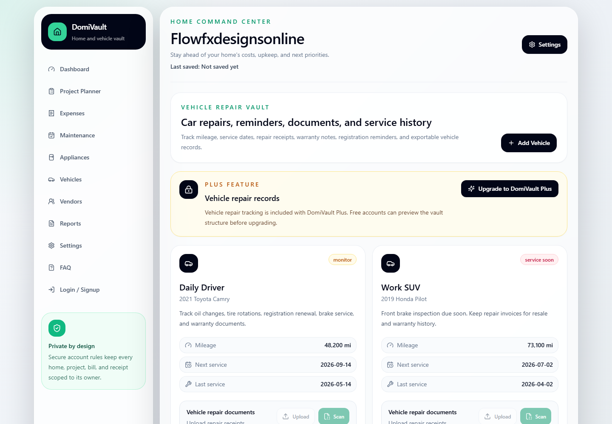
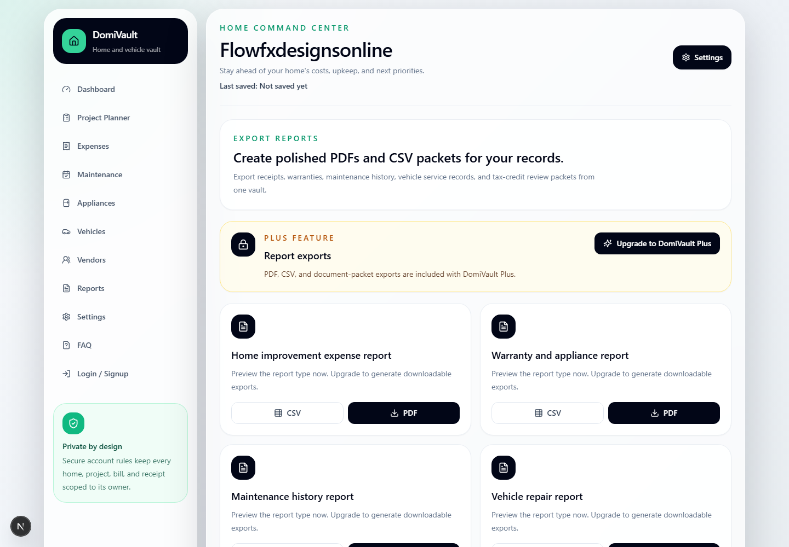
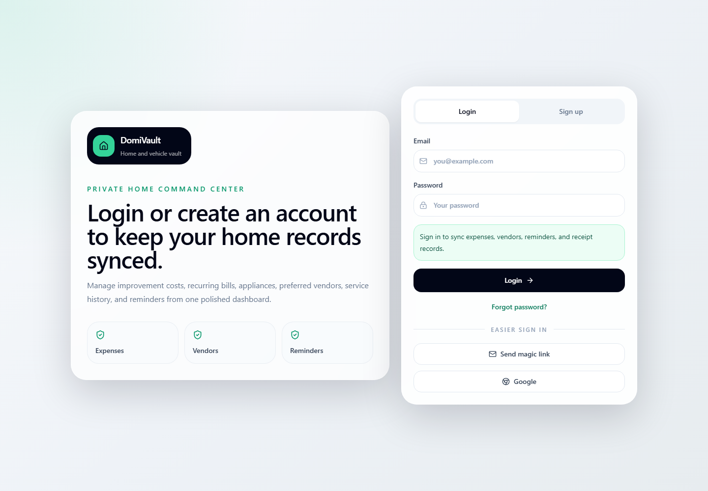

# DomiVault

DomiVault is a premium home command center for keeping home improvement spending, utility bills, appliance records, repair reminders, vendor contacts, vehicle service notes, and important documents organized in one secure dashboard.

It is built as a responsive Next.js app with Supabase-ready auth, database tables, storage rules, and row-level security so each user only sees their own home records.

## Screenshots













## Demo Video

A video walkthrough is not committed yet. The app is ready for a short recording that covers login, dashboard metrics, expenses, appliance warranty records, vehicle repairs, reports, and settings.

Recommended recording flow:

1. Open `/login`.
2. Sign in or use local preview mode.
3. Show `/dashboard`, `/expenses`, `/maintenance`, `/appliances`, `/vehicles`, `/reports`, and `/settings`.
4. Export the recording as `public/demo/domivault-walkthrough.mp4`.
5. Add this block to the README:

```html
<video src="public/demo/domivault-walkthrough.mp4" controls width="100%"></video>
```

## Core Features

- Personalized Home Command Center that greets the user by username and shows the last saved timestamp.
- Expense and utility bill tracker with editable records, project links, category filters, optional tax-review markers, and energy-efficiency tax credit guidance.
- Separate project planner so planned budgets do not distort actual expense totals.
- Maintenance scheduler with notes, recurring intervals, reminder channels, calendar export, and completion status.
- Appliance tracker with age, service dates, warranty expiration alerts, notes, and edit/delete actions.
- Vendor address book for contractors, home service providers, appliance repair, and preferred contacts.
- Settings page for username, home profile, reminder defaults, theme, plan tier, and profile backup timestamps.
- FAQ page for onboarding and product explanation.

## Free vs. DomiVault Plus

| Area | Free | DomiVault Plus |
| --- | --- | --- |
| Dashboard, projects, expenses, vendors | Included | Included |
| Appliance list and basic service dates | Included | Included |
| Warranty tracking and expiration alerts | Preview locked | Included |
| Receipt and document storage | Preview locked | Included |
| Maintenance history | Preview locked | Included |
| Google Calendar sync | Preview locked | Included |
| Vehicle repair records | Preview locked | Included |
| Export reports | Preview locked | Included |

Paid features are represented in the UI with DomiVault Plus locks so the product shape is visible while the billing layer is still being connected.

## Tech Stack

- Next.js App Router
- React and TypeScript
- Tailwind CSS
- Supabase Auth, Postgres, Storage, and RLS
- Recharts
- Lucide icons

## Folder Structure

```text
app/
  appliances/
  auth/
  dashboard/
  expenses/
  faq/
  login/
  maintenance/
  projects/
  reports/
  settings/
  vehicles/
  vendors/
components/
  appliances/
  auth/
  dashboard/
  expenses/
  faq/
  layout/
  projects/
  reports/
  settings/
  ui/
  vehicles/
  vendors/
hooks/
lib/
  auth/
  supabase/
public/
  screenshots/
supabase/
  schema.sql
types/
```

## Getting Started

```bash
npm install
npm run dev
```

Open:

```text
http://localhost:3000
```

The app can render in local preview mode without Supabase keys. Add Supabase keys when you want auth and profile sync.

## Environment

Create `.env.local` in the project root:

```bash
NEXT_PUBLIC_SUPABASE_URL=your_supabase_project_url
NEXT_PUBLIC_SUPABASE_ANON_KEY=your_supabase_anon_key
```

Do not commit `.env.local`. Keep real service keys in Supabase, hosting-provider environment variables, or Supabase Vault for server-side secrets.

## Supabase Setup

Run the SQL in `supabase/schema.sql` inside the Supabase SQL editor.

The schema creates:

- `profiles`
- `projects`
- `expenses`
- `bills`
- `maintenance_tasks`
- `appliances`
- `vendors`
- `service_events`
- `reminders`
- `vault_documents`
- `vehicles`
- `vehicle_service_events`
- private `receipts` storage bucket

RLS policies are enabled for every app table so authenticated users can only manage rows scoped to their own `auth.uid()`.

## Auth Setup

In Supabase Auth settings:

- Enable email/password sign-in.
- Enable magic links if you want passwordless login.
- Enable Google OAuth only if you want the Google button active.
- Keep GitHub OAuth disabled unless it is intentionally reintroduced.
- Set the Site URL to your DomiVault app URL.
- Add redirect URLs for local and production:

```text
http://localhost:3000/auth/callback
http://localhost:3005/auth/callback
http://localhost:3000/auth/update-password
http://localhost:3005/auth/update-password
https://your-production-domain.com/auth/callback
https://your-production-domain.com/auth/update-password
```

Password recovery should point to DomiVault:

```text
https://your-production-domain.com/auth/update-password
```

For local development, use:

```text
http://localhost:3005/auth/update-password
```

## Document Uploads and Scanning

Receipt, warranty, vehicle, and report uploads are modeled with `vault_documents` plus the private `receipts` storage bucket.

Suggested implementation path:

1. Upload files to `receipts/{user_id}/{document_type}/{file_name}`.
2. Store metadata in `vault_documents`.
3. Link rows to expenses, appliances, maintenance tasks, service events, or vehicles.
4. Add OCR later with a server route or Supabase Edge Function.
5. Keep edit/delete controls on the metadata record and delete the matching storage object when a document is removed.

## Google Calendar and Reminders

Basic calendar export is available from maintenance tasks. A full Google Calendar integration should remain a DomiVault Plus feature and should use OAuth with scoped calendar permissions.

Reminder delivery is modeled in the schema with email, SMS, and push channels. Production delivery can be handled by Supabase Edge Functions plus a provider such as Resend, Twilio, or Firebase Cloud Messaging.

## Google Play Deployment

DomiVault is currently a web app. To ship on Google Play, wrap it as a mobile app using Capacitor or a native shell, then publish an Android App Bundle. Use Google’s official publishing, app bundle, and Play Console setup docs as the source of truth:

- Android publishing guide: https://developer.android.com/studio/publish
- Android App Bundles: https://developer.android.com/guide/app-bundle
- Play Console app setup: https://support.google.com/googleplay/android-developer/answer/9859152

Recommended mobile checklist:

- Add Capacitor or a native Android wrapper.
- Configure app name, package id, adaptive icon, splash screen, and deep links.
- Test auth redirect URLs on Android.
- Build a signed `.aab`.
- Complete Play Console app content, privacy, data safety, screenshots, and testing tracks.
- Release first to internal testing before production.

## GitHub

Repository:

```text
https://github.com/lvcg/Domivault
```

Suggested PR title:

```text
Rename app to DomiVault and add premium home records vault features
```

Suggested PR summary:

```text
This update repositions the app as DomiVault, a home and vehicle records command center. It adds premium-feature previews for warranty tracking, document storage, vehicle repair records, export reports, Google Calendar sync, and maintenance history; refreshes branding, favicon, navigation, FAQ, and screenshots; and extends the Supabase schema for plans, vault documents, vehicles, and service records.
```
